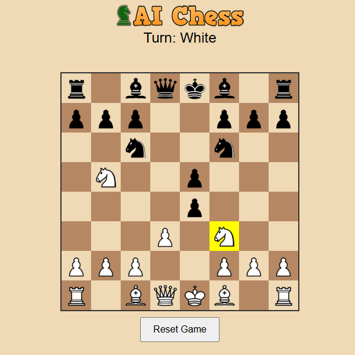
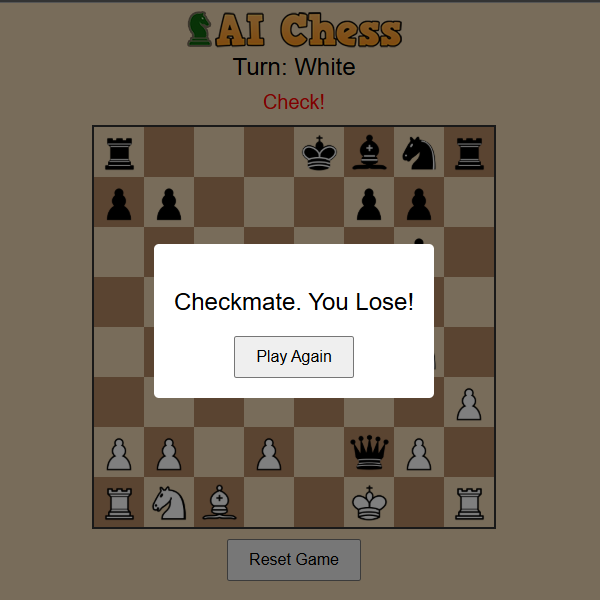

# ♟️ AI Chess: LLM Powered Chess via REST API


## 📖 Overview
AI Chess is a web application that allows users to play chess against a Large Language Model (LLM). 

This project tackles the unique engineering challenge of translating a rigid, rules-based game into a stateless REST API conversation, complete with strict validation loops to handle AI hallucinations.

## ✨ Technical Highlights & Challenges Solved

Building a chess game around an LLM presents a unique problem: **LLMs frequently hallucinate illegal chess moves.** To solve this, the backend is designed to act as a strict referee and state manager.

* **Stateless PGN Management:** The game state is tracked using Portable Game Notation (PGN). The backend persists the PGN for active sessions, retrieving and appending the move history on every REST request.
* **The Validation & Retry Loop:** When the LLM API suggests a move, the Node.js backend intercepts it and validates it against the current board state. 
* **Fault Tolerance:** If the AI attempts an illegal move (e.g., moving a knight in a straight line), the backend automatically rejects it and triggers a retry mechanism, re-prompting the AI behind the scenes until a legal move is generated, ensuring a seamless experience on the frontend.

## 🛠️ Tech Stack
* **Backend:** Node.js, Express.js
* **State Management:** Simple browser localStorage
* **AI Integration:** [Gemini API]
* **Frontend:** [Vanilla JS, HTML/CSS]

## 🛠️ Tech Stack
* **Backend:** Node.js, Express.js
* **State Management:** Simple browser localStorage
* **AI Integration:** [Gemini API]
* **Frontend:** [Vanilla JS, HTML/CSS]

## 💻 Local Installation

1. Clone the repository:
   ```bash
   git clone https://github.com/sumarditjhai-sys/aichess.git
   
2. Change API_KEY in .env

3. ```bash
   cd backend
   npm install
   npm start

Are you smarter then AI? **[🎮 Play the Live Game Here](https://chess.ardy.codes.com)**

---

<div align="center">
  
</div>
<div align="center">
  
</div>

---
